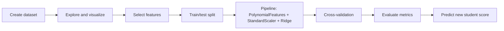

# Student Performance Prediction

## Project Description
This project predicts student performance scores from academic and lifestyle inputs such as study hours, attendance, assignments completed, and sleep hours. It uses a compact machine learning workflow built in Python and demonstrated in a Jupyter Notebook.

## Objective
To build a clean regression-based prediction system that estimates student performance, evaluates model quality more reliably, and produces a score prediction for a new student profile.

## Process

1. Create a student dataset with performance-related features.
2. Explore the data and visualize the relationship between study hours and performance.
3. Split the dataset into training and testing sets.
4. Train a pipeline with polynomial features, scaling, and Ridge regression.
5. Validate the model with K-fold cross-validation.
6. Measure performance on the holdout test set.
7. Predict the score of a new student.

## Tools Used
- Python
- Jupyter Notebook
- Pandas
- NumPy
- Matplotlib
- scikit-learn

## Analysis / Procedure
The notebook follows a simple machine learning flow: data creation, visualization, preprocessing, model training, evaluation, and prediction. The advanced version of the model uses polynomial features to capture non-linear patterns, standardization for stable training, and Ridge regression to reduce overfitting.

### Screenshots
<table>
    <tr>
        <td align="center">
            <strong>Dataset Preview</strong> 
            
        </td>
        <td align="center">
            <strong>Study Hours vs Performance</strong> 
            
        </td>
    </tr>
    <tr>
        <td align="center">
            <strong>Model Evaluation</strong> 
            
        </td>
        <td align="center">
            <strong>Final Prediction</strong> 
            
        </td>
    </tr>
</table>

## Outcomes
- A trained student performance prediction model
- Cross-validated MAE and R-squared values
- Holdout test-set evaluation results
- A predicted score for a new student profile

## Learning and Difficulties
### Learning
- Building a full machine learning workflow from data to prediction
- Improving model quality with preprocessing and feature engineering
- Using cross-validation to get a more reliable evaluation

### Difficulties
- Keeping the notebook organized while adding more advanced steps
- Making the prediction cell work correctly with the pipeline
- Interpreting metrics on a small synthetic dataset

## Future Aspects
- Use a real student dataset instead of synthetic data
- Add more meaningful academic and behavioral features
- Compare additional models such as Random Forest, SVR, or XGBoost
- Save the trained model for reuse
- Build a small web app for live predictions
