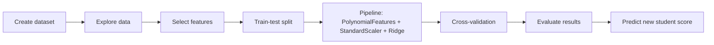

# Student Performance Prediction

[Project Overview](#project-overview) • [Objective](#objective) • [Process](#process) • [Tools Used](#tools-used) • [Analysis / Procedure](#analysis--procedure) • [Outcomes](#outcomes) • [Learning and Difficulties](#learning-and-difficulties) • [Future Aspects](#future-aspects)

---

## Project Overview

This project predicts a student's performance score using a small machine learning workflow built in Python. It starts with a synthetic student dataset and uses features such as study hours, attendance, assignments completed, and sleep hours to estimate performance.

What this project demonstrates

- Data creation and exploration
- Feature selection and preprocessing
- Model training with a pipeline
- Cross-validation for more reliable evaluation
- Prediction for a new student profile

## Objective

The objective of the project is to build a simple but more advanced prediction system that can estimate academic performance from student behavior and study habits.

Primary goals

- Understand which factors influence performance
- Compare training and cross-validated results
- Produce a reusable prediction workflow
- Show the result clearly in a notebook and README

## Process

Step-by-step workflow

1. A student dataset is created with academic and lifestyle features.
2. The target variable, performance score, is generated from the input features.
3. The dataset is split into training and testing subsets.
4. A machine learning pipeline is built with polynomial feature expansion, scaling, and Ridge regression.
5. Five-fold cross-validation is used to check how stable the model is.
6. The model is evaluated on the holdout test set.
7. A new student profile is passed into the model to generate a predicted score.

## Tools Used

Development tools

- Python
- Jupyter Notebook
- Pandas
- NumPy
- Matplotlib
- scikit-learn

Machine learning methods

- Train/test split
- Polynomial feature engineering
- Standardization
- Ridge regression
- K-fold cross-validation
- Evaluation using MAE and R-squared

## Analysis / Procedure

The notebook follows a clear ML pipeline:

1. Create a dataset with student-related inputs.
2. Visualize the relationship between study hours and performance.
3. Train a regression model using a pipeline.
4. Measure performance with cross-validation and holdout testing.
5. Predict the score for a new student.

### Screenshots

<table>
    <tr>
        <td align="center">
            <strong>Dataset Preview</strong> 
            
        </td>
        <td align="center">
            <strong>Study Hours vs Performance</strong> 
            
        </td>
    </tr>
    <tr>
        <td align="center">
            <strong>Model Evaluation</strong> 
            
        </td>
        <td align="center">
            <strong>Final Prediction</strong> 
            
        </td>
    </tr>
</table>

Why the model is more advanced now

Instead of a plain linear regression baseline, the notebook now uses a pipeline with:

- PolynomialFeatures to capture non-linear patterns
- StandardScaler to normalize feature values
- Ridge regression to reduce overfitting
- KFold cross-validation for better evaluation

## Outcomes

The notebook now produces:

- A trained prediction model
- Cross-validated MAE and R-squared values
- Holdout test-set metrics
- A score prediction for a new student

Example result

The upgraded pipeline returns a strong fit on the small synthetic dataset and generates a predicted performance score for the sample student profile.

## Learning and Difficulties

What I learned

- How to structure a full ML notebook from data creation to prediction
- How preprocessing improves model quality
- How cross-validation gives a better estimate than a single train/test split
- How to package the workflow with a pipeline

Challenges faced

- Keeping the notebook organized while adding more advanced steps
- Making sure the pipeline still worked with the prediction cell
- Interpreting evaluation metrics on a very small dataset
- Formatting the README so it is clear and presentation-ready

## Future Aspects

Possible improvements

- Use a real student dataset instead of synthetic data
- Add more features such as exam history, participation, and parent support
- Compare multiple models such as Random Forest, SVR, and XGBoost
- Save the trained model for reuse
- Build a simple web app for live predictions
- Add screenshots and charts directly into the README

---

## Quick Summary

This project predicts student performance using a more advanced regression workflow and presents the process in a simple, readable format for both README and presentation use.
